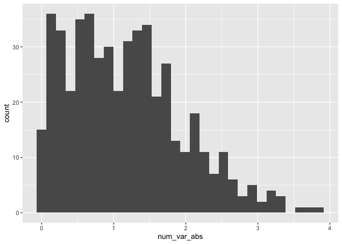

Simple but neat document
================
Ravi Brenner
2024-09-10

Loaded packages (e.g. `tidyverse`)

I’m an R Markdown document!

# Section 1

Here’s a **code chunk** that samples from a *normal distribution*:

``` r
samp = rnorm(100)
length(samp)
```

    ## [1] 100

# Section 2

I can take the mean of the sample, too! The mean is 0.0829187.

# Learning assessment

Learning assessment: Write a named code chunk that creates a dataframe
comprised of: a numeric variable containing a random sample of size 500
from a normal variable with mean 1; a logical vector indicating whether
each sampled value is greater than zero; and a numeric vector containing
the absolute value of each element. Then, produce a histogram of the
absolute value variable just created. Add an inline summary giving the
median value rounded to two decimal places. What happens if you set eval
= FALSE to the code chunk? What about echo = FALSE?

Here is the code, creates `my_df` and then plots a histogram

``` r
# can create variable and immediately use it with the tibble function (if they're in order)
# with base R dataframe function, you can't do this
my_df <- tibble(
  num_var = rnorm(500, mean = 1),
  log_var = if_else(num_var > 0, TRUE, FALSE),
  num_var_abs = abs(num_var)
)

ggplot(my_df,aes(x = num_var_abs)) +
  geom_histogram()
```

<!-- -->

The median value is 1.08

# Formatting text

## Text formatting

*italic* or *italic* **bold** or **bold** `code` superscript<sup>2</sup>
and subscript<sub>2</sub>

## Headings

# 1st Level Header

## 2nd Level Header

### 3rd Level Header

## Lists

- Bulleted list item 1

- Item 2

  - Item 2a

  - Item 2b

1.  Numbered list item 1

2.  Item 2. The numbers are incremented automatically in the output.

## Tables

| First Header | Second Header |
|--------------|---------------|
| Content Cell | Content Cell  |
| Content Cell | Content Cell  |
